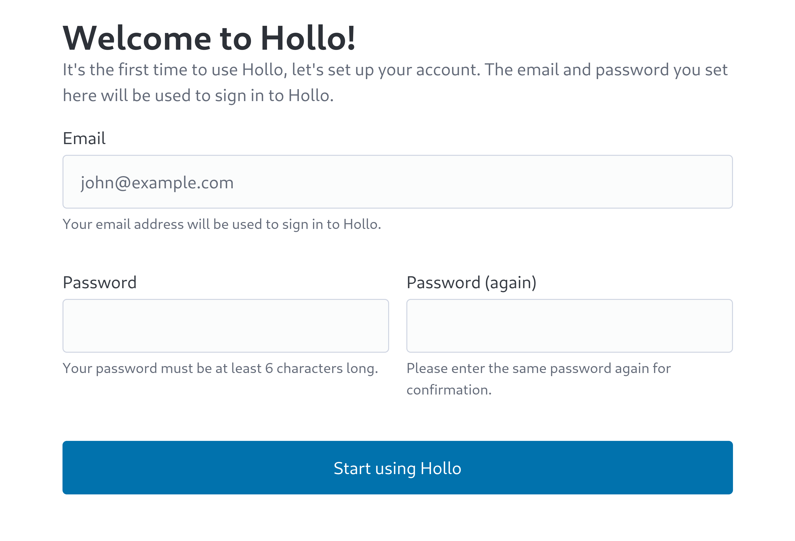
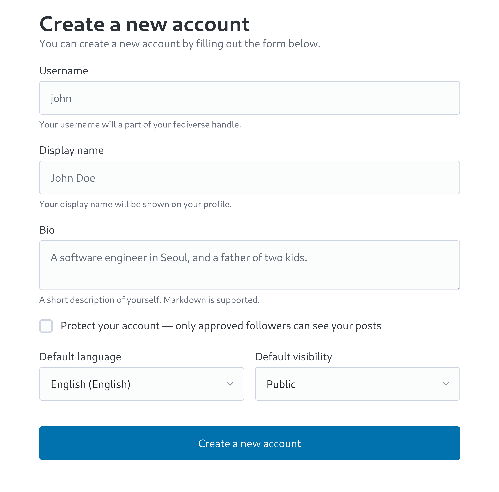
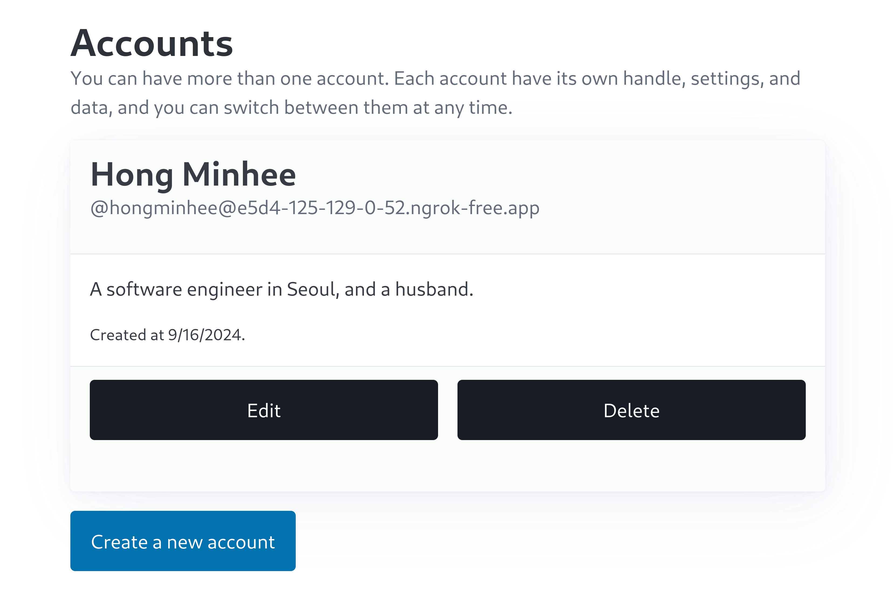
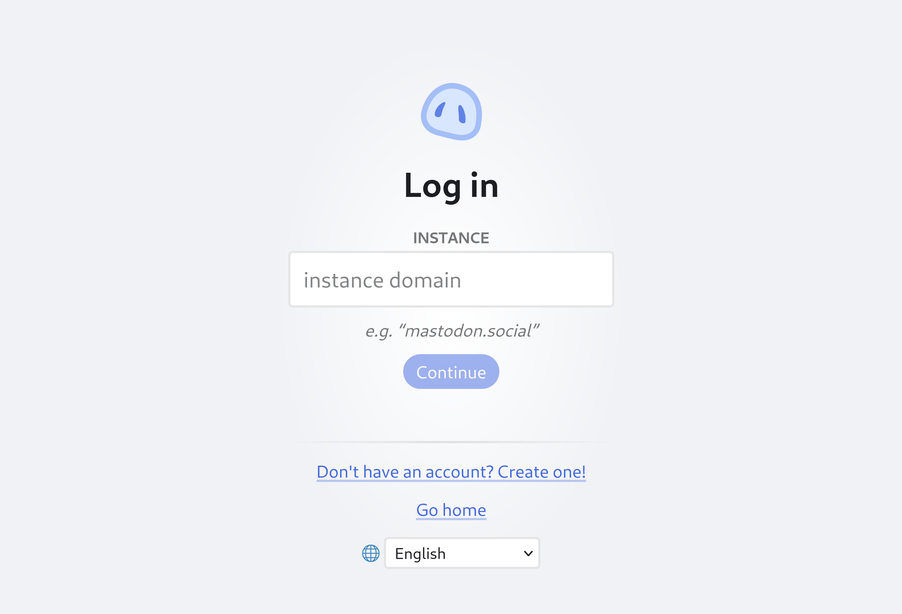
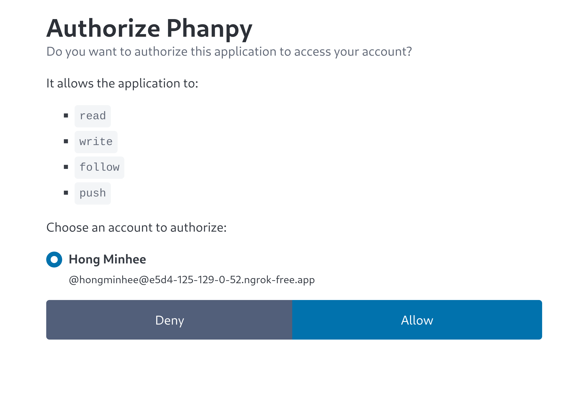
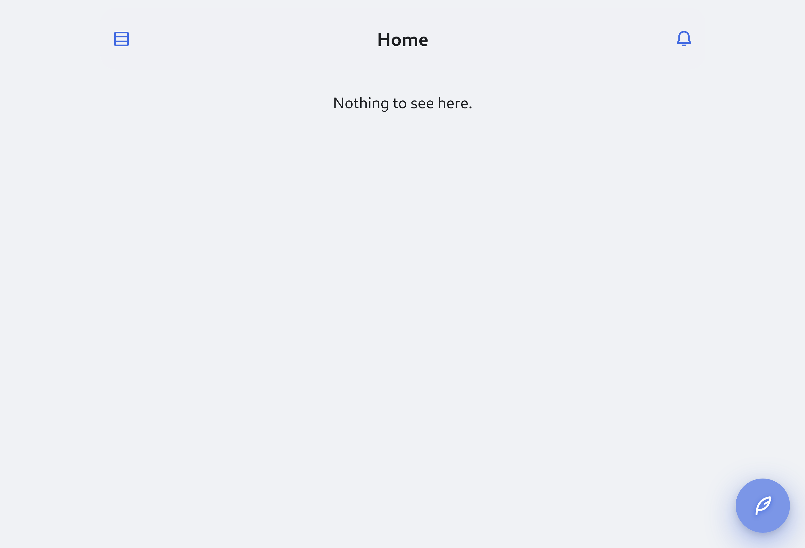

import { Aside, Steps } from "@astrojs/starlight/components";

<Aside type="caution" title="주의">
  Hollo의 최초 설정을 하기 앞서, 먼저 도메인 이름을 정하고 그 도메인 이름이
  여러분의 서버를 가르키도록 해둬야 합니다. 왜냐하면, 일단 한 번 Hollo를
  설정한 뒤에는 도메인 이름을 바꿀 수 없기 때문입니다.
</Aside>

Hollo를 설치한 다음에는 최초 설정을 해야 합니다.
이 설명서는 Hollo를 설정하는 과정을 안내합니다.

<Steps>
 1. **https://<var>yourdomain</var>/setup** 페이지로 이동합니다.
    여기서 <var>yourdomain</var>은 여러분의 도메인 이름입니다.

 2. 여러분이 로그인할 때 사용할 이메일 주소와 암호를 설정합니다.

    

 3. 비어있는 Accounts 페이지가 보입니다.
    **Create a new account** 버튼을 클릭합니다.

    

 4. 계정을 만들기 위해 양식을 채웁니다.  **Username** 필드를 뺀 나머지
    항목은 모두 나중에도 변경할 수 있습니다.

    

 5. 계정을 만들고 나면, Accounts 페이지에 여러분이 만든 계정이 나타납니다.

    

 6. Hollo는 자체 웹 인터페이스가 없으므로,
    [Phanpy] 등과 같은 Mastodon 호환 클라이언트 앱을 하나 골라서 사용하셔야 합니다.
    여기서는 Phanpy를 예로 들어 설명합니다.

    **https://phanpy.social/** 페이지에 접속한 뒤,
    **Mastodon으로 로그인** 버튼을 클릭합니다.

 7. 여러분의 Hollo 인스턴스 도메인 이름을 입력한 뒤, **계속**을 누릅니다.

    

 8. 이 때, Hollo 계정으로 로그인하라는 요청이 나올 수 있습니다.
    그러면, 아까 초기 설정에서 입력한 이메일 주소와 암호를 입력하고
    **Sign in** 버튼을 누릅니다.

    만약 로그인을 요청받지 않았다면, 다음 단계로 넘어가세요.

 9. **Authorized Phanpy** 페이지가 보입니다.
    **Allow** 버튼을 눌러 Phanpy가 Hollo 계정에 접근할 수 있도록 허용합니다.

    

10. 이제 다 되었습니다! Phanpy를 사용하여 Hollo 계정에 로그인했습니다.

    타임라인은 처음이라 비어 있긴 하지만,
    게시물을 올리고 다른 사용자를 팔로할 수 있습니다.
    Hollo 공식 계정을 팔로하고 싶다면,
    `@hollo@hollo.social`을 검색하여 프로필 페이지에서 **팔로** 버튼을 누르세요.

    그럼, Hollo를 즐기세요!

    

[Phanpy]: https://phanpy.social/
</Steps>
